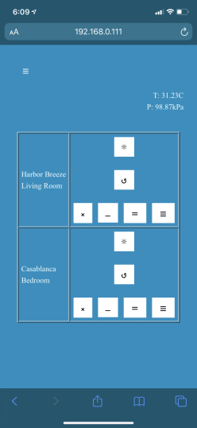

# espRFFanRGBW  
Controlling two different RF fans via webserver (via ESP8266 and modified FS1000A with 303MHz SAW resonator) and RGBW LED Strip

**RF Fan Control**  
RF Fan feature is driving modified FS1000A RF/Tx Module by bit-banging bit stream. The timing and the bits are obtained from actual fan remote control and bit timings are implemented in the module. At this stage the timings are not configurable through settings file but hardcoded. A push switch is used to add toggle light feature on one of the fans.  
Default configuration is for Casablanca and Harbor Breeze fans.  
Main page interfacing with RF Fan is simple buttons:  

**RGBW and Sunrise Simulation**  
RGBW LED strip is driven by 4 digital output pins. The RGBW color selection through RGB wheel feature (via websockets) is copied from [jaames](https://github.com/jaames/iro.js) repository and modified with simple conversion from RGB to RGBW.  
  
Sunrise feature uses internet time to start a counter on configured time and day, ramps saturation from 0 to 50% to 1st selected color, then ramps from first to second color by linearly interpolating between the tow colors. Intention is to create fast ramp for brightness and slowly increase brightness to final set color. In conjunction to the software configuration an On/Off switch is used to enable/disable auto-scheduling of sunrise feature.  
Ramp function simply behaves as in the image below:  
  
Configuration page for sunruse schedule:  

**Config**  
On power up module looks for config.dat file containing wifi name, password (in plain text) optional IFTTT key and MAC address. If there is no wifi information module will start in AP mode where it can be used for basic RF and RGBW control functionality or configured to access another AP (accessible through 192.168.0.1).  
Device wifi config:  
  

For ease of debugging a simple circular log buffer is created, where messages are printed to the buffer overwriting the oldest content. If a telnet client is connected contents of buffer are sent (and emptied) to the client.

IFTTT push button is added to board as well which can invoke IFTTT request.

Digital inputs are processed as interrupts and designed with minimal interrupt load, i.e. they only set a flag to be process by the main loop. A small debounce strategy is added to avoid quick toggle/noise on the inputs.

**Schematic**  

